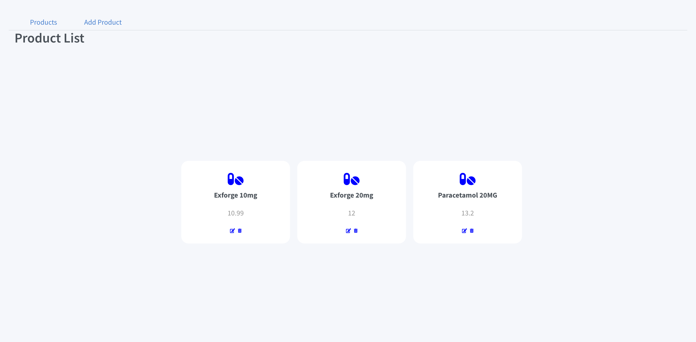
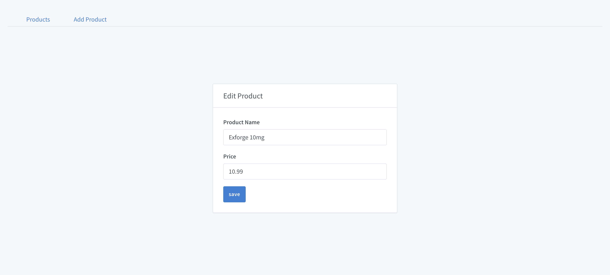
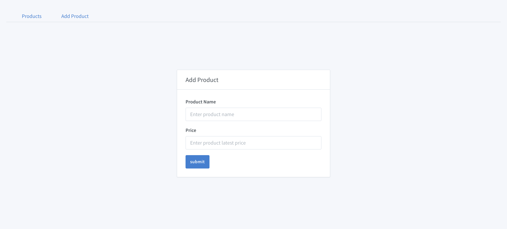

# PRODUCT PRICE HISTORY APP

## Project Objective

This is this a simple complete react App that manageS a list of products and their historical. It uses Redux for state managment, React-Router for routing, Normalizr for normalizing data in redux store, redux-persist to persist data in store and Jest and React Testing Library for testing
prices.

## How to run the Program on Your Computer

You’ll need to have Node >= 8.10 on your local development machine (but it’s not required on the server). You can use [nvm](https://github.com/creationix/nvm#installation) (macOS/Linux) or [nvm-windows](https://github.com/coreybutler/nvm-windows#node-version-manager-nvm-for-windows) to switch Node versions between different projects.

Locate the path of the project and install the dependencies with the command below

```
git clone https://github.com/kwabena53/front-end-challenge.git
npm install or yarn install
```

Run the following command to start the app on your local service http://localhost:3000/

```
npm start or yarn start
```

### Functionalities of the App

The application allows users to

- [`Display List of Products`](#Display Product List) Showing name and latest price of product
- [`Edit Product Details`](#Edit Product Details)
- [`Delete Product`](#Delete Product)
- [`Add a new Product`](#Add a new Product)

### `Display Product List`

The hom page of the app shows a display of all the products. This list is coming from an external API and it is stored in the redux store and
persisted. Each products displays the name, latest price and 2 icons. One icon is a delete icon and the other is an edit icon



### `Edit Product`

This screen allows you to edit the details of a particular product you have selected. When the edit icon is clicked, it leads the user to a new page. This page allows the user to edit the details of the product. You can change the name and the price of the product.



### `Delete Product`

A user can delete a product by simply clicking on the delete icon on that product. This imediately deletes the item.

### `Add a new Product`

You can easily add a new product by selecting "Add Product" on the menu navigation. A new page shows where the user can add a product by specifying the name and the price of that item


